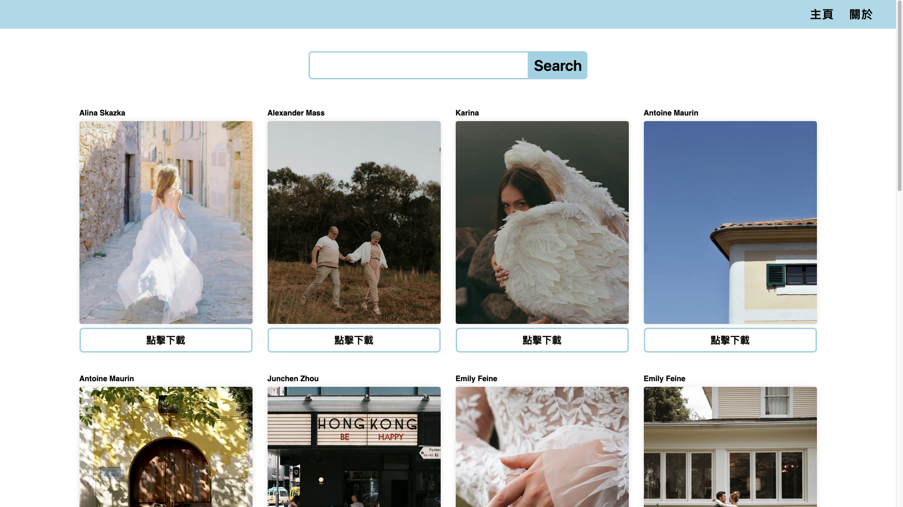
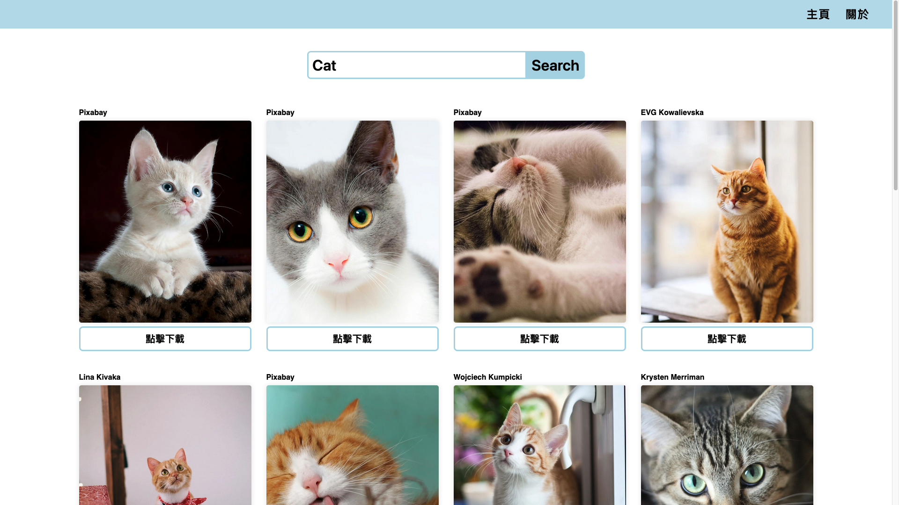
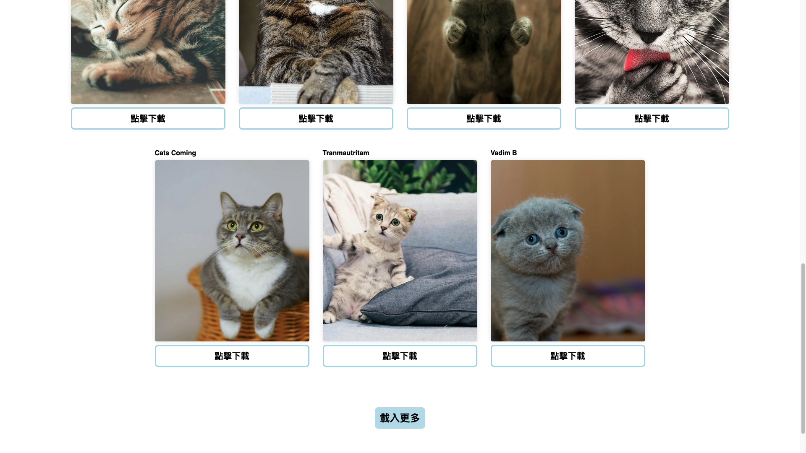

# Pexels 圖片搜尋網站 📷🔎

此專案於 2024 年 3 月製作，為第一個 React 練習專案

「Pexels 圖片搜尋網站」讓使用者可以搜尋 Pexels 上提供的高品質圖片，並可以直接下載所需圖片。

## 專案截圖 🖥

### 首頁

### 搜尋圖片

### 載入更多按鈕

## 使用技術 🔧

- **JavaScript**：負責邏輯撰寫
- **React**：建立前端使用者介面，並透過 `React Hook` 管理狀態及 `React Router` 處理路由
- **SCSS**：使用 `SCSS` 預處理器進行樣式設計
- **axios**：透過 `axios` 串接 Pexels API 進行圖片搜尋，負責 HTTP 請求和回應的處理

## 功能 🚀

- **搜尋圖片**：輸入關鍵字搜尋 Pexels 上的圖片
- **下載圖片**：點擊圖片下載按鈕下載所需圖片

## 執行方式 🏃

1. `git clone` 此專案至本機
2. `cd` 進入專案資料夾
3. `npm install` 安裝相關套件
4. 編譯 `SCSS` 檔案
5. 放入 `Pexels API` 金鑰
6. `npm start` 開啟專案
